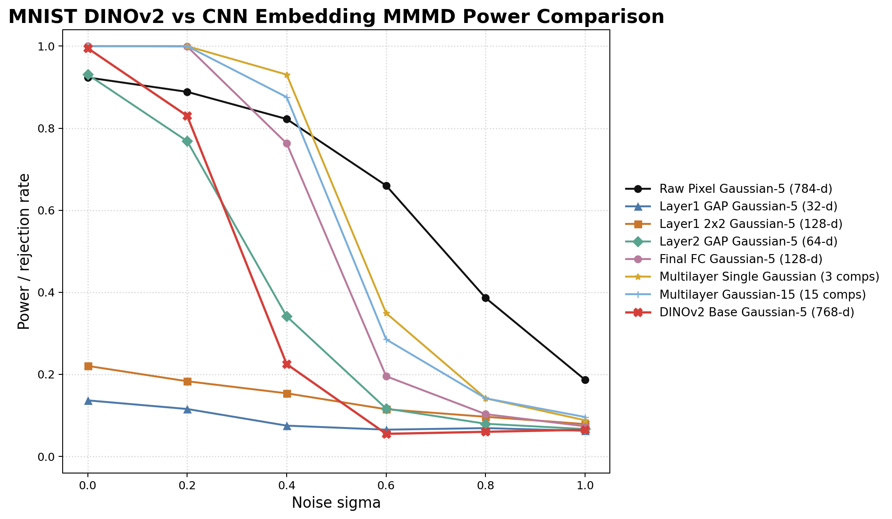
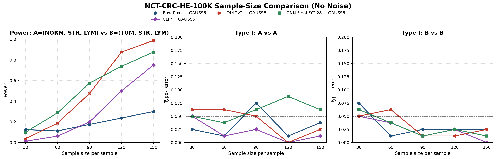

# Full Experiment Report for `yao/`

Date: 2026-06-16

This document summarizes the experiments, code, figures, and empirical conclusions produced under the `yao/` workspace. The central research question is whether image representations from raw pixels, frozen foundation encoders, and task-trained CNNs can improve kernel two-sample testing on biomedical images, and whether lrj's covariance-stabilized MMMD variant improves the testing layer.

## Compact Outline

- **Problem.** We study two-sample testing for image distributions, where each image is first mapped to a feature representation and then compared using MMMD-style tests.
- **Representation layer.** We compare raw pixels, CLIP, DINOv2, and task-trained CNN embeddings.
- **Testing layer.** We compare the paper's original Gaussian multi-kernel MMMD family, mainly `GAUSS5` / `GEXP-5`, with lrj's `NEW-MMMD`.
- **Datasets.** We run experiments on MNIST, BloodMNIST-224, PathMNIST-28, and NCT-CRC-HE-100K.
- **Metrics.** We report power / rejection rate under alternatives, Type-I error under matched nulls, and sample-size efficiency.
- **Main finding.** Task-trained CNNs are strongest on BloodMNIST-224; DINOv2 is strongest at large sample sizes on NCT-CRC; lrj's method mainly improves numerical stability and Type-I conservativeness rather than uniformly increasing power.

## Workspace Contents

The `yao/` folder contains a complete experiment layer on top of the original paper/dechao/lrj code. The most important subfolders are:

- `yao/scripts/`: Python/R drivers for embedding extraction, CNN training, raw-pixel baselines, MMMD testing, lrj testing, and plotting.
- `yao/configs/`: R configs for fixed BloodMNIST and MNIST noisy embedding tests.
- `yao/src/`: local MMMD R helpers adapted for the project.
- `yao/data/embeddings/`: cached `.npy + metadata.csv` feature pools. These are intentionally reusable and should not be committed if large.
- `yao/models/`: task-trained CNN checkpoints, metrics, curves, and confusion matrices.
- `yao/results/`: summary CSVs, figures, logs, and reports.

## Method Summary

The project separates the pipeline into two conceptual layers.

1. **Representation layer.** An image is represented as raw pixels, a frozen CLIP embedding, a frozen DINOv2 embedding, or a feature from a CNN trained on the target dataset. CNN features include `layer1_gap`, `layer2_gap`, and `final_fc128`.
2. **Testing layer.** Given two matrices of features, the project runs two-sample tests using the original paper's MMMD implementation (`GAUSS5` / `GEXP-5`) or lrj's `NEW-MMMD`, which uses covariance stabilization and pivoted-Cholesky kernel pruning.

The fixed-pool design is used heavily. Images are transformed into feature pools once and saved as `embeddings.npy + metadata.csv`. Testing then repeatedly samples from these pools. For Type-I error, the final design uses either multiple independent noisy pools or splits matched null samples from a shared label pool to avoid the inflated false positives seen in the early single-fixed-pool null experiment.

## Core Scripts

| Script | Role |
| --- | --- |
| `yao/scripts/extract_mnist_noise_embeddings.py` | MNIST noisy image to DINOv2/embedding pool workflow. |
| `yao/scripts/extract_medmnist_noise_embeddings.py` | MedMNIST/BloodMNIST noisy embedding extraction for CLIP/DINOv2. |
| `yao/scripts/extract_imagefolder_noise_embeddings.py` | Folder-based datasets such as NCT-CRC to CLIP/DINOv2 embedding pools. |
| `yao/scripts/extract_imagefolder_raw_embeddings.py` | Folder-based raw-pixel pool extraction for lrj tests. |
| `yao/scripts/bloodmnist_cnn_pipeline.py` | BloodMNIST-224 CNN training and feature extraction. |
| `yao/scripts/imagefolder_cnn_pipeline.py` | Generic image-folder CNN training for NCT-CRC. |
| `yao/scripts/extract_bloodmnist_cnn_noise_embeddings.py` | BloodMNIST CNN noisy feature pool extraction. |
| `yao/scripts/extract_imagefolder_cnn_embeddings.py` | NCT-CRC CNN feature pool extraction. |
| `yao/scripts/run_noisy_embedding_testing.R` | Main R testing driver for `.npy + metadata.csv` pools. |
| `yao/scripts/run_rawpixel_gauss5_mixed.py` | BloodMNIST raw-pixel Gaussian-5 baseline. |
| `yao/scripts/run_rawpixel_gauss5_imagefolder.py` | NCT-CRC raw-pixel Gaussian-5 baseline. |
| `yao/scripts/run_nct_crc_sample_size.py` | NCT-CRC raw/CLIP/DINOv2 sample-size workflow. |
| `yao/scripts/run_nct_crc_cnn_sample_size.py` | NCT-CRC CNN sample-size workflow. |
| `yao/scripts/lrj_mmmd_utils.py` | Python implementation of `GEXP-5` and `NEW-MMMD`. |
| `yao/scripts/run_lrj_sample_size_comparison.py` | lrj-style sample-size comparison on any embedding pool. |
| `yao/scripts/plot_*` | Plotting utilities for MNIST, BloodMNIST, PathMNIST, NCT-CRC, and lrj comparisons. |

## Experiment Inventory

| ID | Dataset | Task | Representation(s) | Test layer | Status | Key output |
| --- | --- | --- | --- | --- | --- | --- |
| E01 | MNIST | `{1,2,3}` vs `{1,2,8}`, six noise levels | DINOv2 | `GAUSS5` | Medium first pass | `yao/results/mnist_dinov2_dechao_power_medium/` |
| E02 | MNIST | same as E01 | DINOv2 | `GAUSS5` | smoke / npy I/O checks | `yao/results/mnist_dinov2_*smoke/` |
| E03 | BloodMNIST-224 | `basophil(0)` vs `lymphocyte(4)` | DINOv2 | `GAUSS5` | completed | `bloodmnist224_dinov2_baso_lymph_power_sharedpool/` |
| E04 | BloodMNIST-224 | `basophil` null and `lymphocyte` null | DINOv2 | `GAUSS5` | completed | `bloodmnist224_dinov2_baso_type1_sharedpool/`, `bloodmnist224_dinov2_lymph_type1_sharedpool/` |
| E05 | BloodMNIST-224 | early `basophil` fixed-pool null | DINOv2 | `GAUSS5` | diagnostic only | `bloodmnist224_dinov2_baso_type1_fixedpool/` |
| E06 | BloodMNIST-224 | `A=(0,1,3)` vs `B=(0,1,6)`, six noise levels | DINOv2 | `GAUSS5` | completed | `bloodmnist224_dinov2_mix013_vs_016_power_sharedpool/` |
| E07 | BloodMNIST-224 | matched nulls for E06 | DINOv2 | `GAUSS5` | completed | `bloodmnist224_dinov2_mix013_type1_sharedpool/`, `bloodmnist224_dinov2_mix016_type1_sharedpool/` |
| E08 | BloodMNIST-224 | same mixed task | Raw pixels | `GAUSS5` | completed | `bloodmnist224_rawpixel_mix*_gauss5/` |
| E09 | BloodMNIST-224 | same mixed task | CLIP | `GAUSS5` | completed | `bloodmnist224_clip_mix*_sharedpool/` |
| E10 | BloodMNIST-224 | same mixed task | CNN `final_fc128` | `GAUSS5` | completed | `bloodmnist224_cnn_finalfc_mix*_sharedpool/` |
| E11 | BloodMNIST-224 | sample-size sweep at `sigma=0.6` | Raw, CLIP, DINOv2 | `GAUSS5` | completed | `bloodmnist224_sample_size_sigma06/` |
| E12 | PathMNIST-28 | dechao-aligned `mix635` vs `mix835` | DINOv2, CLIP | `GAUSS5` | completed | `pathmnist28_*_alignment/` |
| E13 | PathMNIST-28 | comparison to dechao CNN baselines | DINOv2, CLIP, CNN baselines | `GAUSS5` / multilayer baselines | completed | `pathmnist28_vs_cnn_comparison/` |
| E14 | NCT-CRC | `A=(NORM,STR,LYM)` vs `B=(TUM,STR,LYM)` | Raw, CLIP, DINOv2 | `GAUSS5` | first pass | `nctcrc_sample_size_firstpass/` |
| E15 | NCT-CRC | same as E14 | CNN `final_fc128` | `GAUSS5` | first pass | `nctcrc_cnn_sample_size_firstpass/` |
| E16 | NCT-CRC | same as E14 | CNN `layer1_gap`, `layer2_gap` | `GAUSS5` | first pass | `nctcrc_cnn_layer*gap_sample_size_firstpass/` |
| E17 | NCT-CRC | same as E14 | Raw, CLIP, DINOv2, CNN | `GAUSS5` | merged comparison | `nctcrc_sample_size_with_cnn/` |
| E18 | NCT-CRC | same as E14 | DINOv2 | `GEXP-5` vs `NEW-MMMD` | formal first pass | `nctcrc_lrj_dinov2_formal/` |
| E19 | NCT-CRC | same as E14 | CLIP | `GEXP-5` vs `NEW-MMMD` | formal first pass | `nctcrc_lrj_clip_formal/` |
| E20 | NCT-CRC | same as E14 | CNN `final_fc128` | `GEXP-5` vs `NEW-MMMD` | formal first pass | `nctcrc_lrj_cnn_finalfc_formal/` |
| E21 | NCT-CRC | same as E14 | Raw pixels | `GEXP-5` vs `NEW-MMMD` | formal first pass | `nctcrc_lrj_rawpixel_formal/` |
| E22 | NCT-CRC | representation x test-layer matrix | Raw, CLIP, DINOv2, CNN | `GEXP-5` vs `NEW-MMMD` | completed | `nctcrc_lrj_all_representations/` |

## Valuable Figures

The following figures are the most useful for reports, slides, or paper-style presentation.

| Figure | What it shows | Path |
| --- | --- | --- |
| MNIST DINOv2 vs CNN power | DINOv2 power curve on MNIST compared with dechao CNN/raw baselines. | `yao/results/mnist_dinov2_dechao_power_medium/mnist_dinov2_vs_cnn_power_comparison.png` |
| BloodMNIST class examples | Visual examples of BloodMNIST cell classes. | `yao/results/bloodmnist_class_examples.png` |
| BloodMNIST raw vs DINOv2 | Mixed-population power and Type-I comparison. | `yao/results/bloodmnist224_mixed_rawpixel_vs_dinov2_gauss5/bloodmnist_mixed_rawpixel_vs_dinov2_gauss5.png` |
| BloodMNIST raw vs CLIP vs DINOv2 | Adds CLIP to the mixed-population comparison. | `yao/results/bloodmnist224_mixed_rawpixel_dinov2_clip_gauss5/bloodmnist_mixed_rawpixel_vs_dinov2_vs_clip_gauss5.png` |
| BloodMNIST raw vs CLIP vs DINOv2 vs CNN | Adds task-trained CNN, currently the strongest BloodMNIST representation. | `yao/results/bloodmnist224_mixed_raw_clip_dino_cnn_gauss5/bloodmnist_mixed_raw_clip_dino_cnn_gauss5.png` |
| BloodMNIST sample-size sweep | Power and Type-I as sample size changes at `sigma=0.6`. | `yao/results/bloodmnist224_sample_size_sigma06/bloodmnist_mixed_sample_size_comparison.png` |
| PathMNIST vs dechao CNN | DINOv2/CLIP compared with dechao CNN baselines on PathMNIST-28. | `yao/results/pathmnist28_vs_cnn_comparison/pathmnist_sample_size_vs_cnn.png` |
| NCT-CRC first pass | Raw/CLIP/DINOv2 sample-size sweep on NCT-CRC. | `yao/results/nctcrc_sample_size_firstpass/nctcrc_sample_size_comparison.png` |
| NCT-CRC with CNN | Raw/CLIP/DINOv2/CNN sample-size comparison on NCT-CRC. | `yao/results/nctcrc_sample_size_with_cnn/nctcrc_sample_size_comparison.png` |
| NCT-CRC DINOv2 lrj comparison | `GEXP-5` vs `NEW-MMMD` for DINOv2 features. | `yao/results/nctcrc_lrj_dinov2_formal/lrj_sample_size_comparison.png` |
| NCT-CRC all representations with lrj | Representation layer x testing layer comparison. | `yao/results/nctcrc_lrj_all_representations/nctcrc_lrj_all_representations.png` |
| BloodMNIST CNN training curve | CNN classification training dynamics. | `yao/models/bloodmnist_cnn/training_curves.png` |
| NCT-CRC CNN training curve | CNN classification training dynamics. | `yao/models/nctcrc_cnn/training_curves.png` |

## Figure Panels

### MNIST power comparison

### BloodMNIST representation comparison

### BloodMNIST sample-size sweep

### PathMNIST alignment with dechao

### NCT-CRC representation comparison

### NCT-CRC testing-layer comparison

## Dataset and Task Designs

| Dataset | Image format | Main task | Null tasks | Main reason for use |
| --- | --- | --- | --- | --- |
| MNIST | `28 x 28` grayscale | `{1,2,3}` vs `{1,2,8}` with additive Gaussian noise | not the main focus in `yao` | Reproduce paper/dechao style and expose small-image limitations. |
| BloodMNIST-224 | `224 x 224` RGB cell images | `(0,1,3)` vs `(0,1,6)` and `0` vs `4` | matched same-mixture nulls | Biomedical image benchmark compatible with CLIP/DINOv2 input size. |
| PathMNIST-28 | `28 x 28` RGB pathology patches | `mix635` vs `mix835` | `mix635` vs `mix635` | Strict comparison with dechao's new MedMNIST CNN work. |
| NCT-CRC-HE-100K | `224 x 224` RGB pathology patches | `(NORM,STR,LYM)` vs `(TUM,STR,LYM)` | matched same-mixture nulls | Larger pathology dataset for representation-layer and testing-layer comparison. |

## Main Result Tables

### MNIST: DINOv2 under additive noise

The MNIST result shows that frozen DINOv2 features work at low noise but degrade rapidly as Gaussian noise increases. This is consistent with the mismatch between `28 x 28` handwritten digits and a natural-image foundation encoder that resizes inputs to a much larger resolution.

| noise_sigma | power_mean | power_se | n_rep |
| --- | --- | --- | --- |
| 0.0000 | 0.9950 | 0.0050 | 2 |
| 0.2000 | 0.8300 | 0.0000 | 2 |
| 0.4000 | 0.2250 | 0.0450 | 2 |
| 0.6000 | 0.0550 | 0.0250 | 2 |
| 0.8000 | 0.0600 | 0.0200 | 2 |
| 1.0000 | 0.0650 | 0.0150 | 2 |

### BloodMNIST-224: mixed-population power across noise

The BloodMNIST mixed task is `A=(0,1,3)` versus `B=(0,1,6)`, with balanced class sampling. The CNN `final_fc128` feature is strongest across all noise levels; DINOv2 and CLIP are strong at low-to-moderate noise, while raw pixels are weaker but sometimes more resistant at the heaviest noise.

| noise_sigma | Raw | CLIP | DINOv2 | CNN final |
| --- | --- | --- | --- | --- |
| 0.0000 | 0.6760 | 0.9800 | 0.9220 | 0.9930 |
| 0.2000 | 0.7650 | 0.8480 | 0.8820 | 0.9900 |
| 0.4000 | 0.7630 | 0.9930 | 0.9420 | 0.9780 |
| 0.6000 | 0.6830 | 0.9370 | 0.9760 | 0.9600 |
| 0.8000 | 0.5960 | 0.6370 | 0.8300 | 0.9570 |
| 1.0000 | 0.5150 | 0.3150 | 0.4290 | 0.9170 |

### BloodMNIST-224: Type-I error for `A=(0,1,3)` null

The Type-I results show that the corrected shared-pool null design controls false positives much better than the earlier single-fixed-pool null experiment. CNN and DINOv2 are generally close to nominal, while raw pixels are often conservative.

| noise_sigma | Raw | CLIP | DINOv2 | CNN final |
| --- | --- | --- | --- | --- |
| 0.0000 | 0.0720 | 0.0460 | 0.0530 | 0.0220 |
| 0.2000 | 0.0450 | 0.0490 | 0.0620 | 0.0350 |
| 0.4000 | 0.0280 | 0.0440 | 0.0420 | 0.0330 |
| 0.6000 | 0.0180 | 0.0710 | 0.0420 | 0.0380 |
| 0.8000 | 0.0220 | 0.0690 | 0.0590 | 0.0400 |
| 1.0000 | 0.0150 | 0.0630 | 0.0440 | 0.0550 |

### BloodMNIST-224: Type-I error for `B=(0,1,6)` null

| noise_sigma | Raw | CLIP | DINOv2 | CNN final |
| --- | --- | --- | --- | --- |
| 0.0000 | 0.0490 | 0.0340 | 0.0500 | 0.0110 |
| 0.2000 | 0.0190 | 0.0390 | 0.0380 | 0.0170 |
| 0.4000 | 0.0170 | 0.0280 | 0.0240 | 0.0170 |
| 0.6000 | 0.0070 | 0.0420 | 0.0250 | 0.0270 |
| 0.8000 | 0.0100 | 0.0420 | 0.0350 | 0.0250 |
| 1.0000 | 0.0110 | 0.0630 | 0.0280 | 0.0210 |

### BloodMNIST-224: sample-size effect at `sigma=0.6`

The sample-size experiment shows that learned embeddings improve sample efficiency. DINOv2 and CLIP achieve high power with fewer samples; raw pixels need larger samples to catch up.

| sample_size | CLIP + GAUSS5 | DINOv2 + GAUSS5 | Raw Pixel + GAUSS5 |
| --- | --- | --- | --- |
| 30 | 0.5000 | 0.5125 | 0.0625 |
| 60 | 0.7750 | 0.8875 | 0.4125 |
| 90 | 0.8875 | 0.9625 | 0.7125 |
| 120 | 0.9625 | 1.0000 | 0.8875 |
| 150 | 1.0000 | 1.0000 | 0.9875 |

### PathMNIST-28: DINOv2 and CLIP under dechao's protocol

The PathMNIST-28 experiments use dechao's overlapping-mixture setup. DINOv2 eventually becomes strong at larger sample sizes, but both frozen encoders trail dechao's task-trained CNN baselines at small and medium sample sizes.

| scenario | sample_size | method_label | noise_sigma | metric_mean | metric_se | n_rep |
| --- | --- | --- | --- | --- | --- | --- |
| power | 30 | DINOV2 + GAUSS5 | 0.0000 | 0.0534 | 0.0039 | 10 |
| power | 60 | DINOV2 + GAUSS5 | 0.0000 | 0.2506 | 0.0066 | 10 |
| power | 90 | DINOV2 + GAUSS5 | 0.0000 | 0.5926 | 0.0080 | 10 |
| power | 120 | DINOV2 + GAUSS5 | 0.0000 | 0.8900 | 0.0047 | 10 |
| power | 150 | DINOV2 + GAUSS5 | 0.0000 | 0.9904 | 0.0016 | 10 |
| type1 | 60 | DINOV2 + GAUSS5 | 0.0000 | 0.0038 | 0.0005 | 10 |
| type1 | 120 | DINOV2 + GAUSS5 | 0.0000 | 0.0034 | 0.0006 | 10 |
| power | 30 | CLIP + GAUSS5 | 0.0000 | 0.1166 | 0.0043 | 10 |
| power | 60 | CLIP + GAUSS5 | 0.0000 | 0.1760 | 0.0051 | 10 |
| power | 90 | CLIP + GAUSS5 | 0.0000 | 0.3232 | 0.0058 | 10 |
| power | 120 | CLIP + GAUSS5 | 0.0000 | 0.5152 | 0.0093 | 10 |
| power | 150 | CLIP + GAUSS5 | 0.0000 | 0.7172 | 0.0059 | 10 |
| type1 | 60 | CLIP + GAUSS5 | 0.0000 | 0.0542 | 0.0024 | 10 |
| type1 | 120 | CLIP + GAUSS5 | 0.0000 | 0.0288 | 0.0028 | 10 |

### NCT-CRC: representation-layer comparison

The NCT-CRC task is `A=(NORM,STR,LYM)` versus `B=(TUM,STR,LYM)`. On this larger pathology dataset, DINOv2 is strongest at large sample sizes, while the trained CNN is strongest or competitive at small-to-medium sample sizes. CLIP improves with sample size but stays below DINOv2; raw pixels remain weakest.

| sample_size | CLIP + GAUSS5 | CNN Final FC128 + GAUSS5 | DINOv2 + GAUSS5 | Raw Pixel + GAUSS5 |
| --- | --- | --- | --- | --- |
| 30 | 0.0125 | 0.1000 | 0.0375 | 0.1250 |
| 60 | 0.0625 | 0.2875 | 0.1875 | 0.1125 |
| 90 | 0.2000 | 0.5750 | 0.4750 | 0.1750 |
| 120 | 0.5000 | 0.7375 | 0.8750 | 0.2375 |
| 150 | 0.7500 | 0.8750 | 0.9875 | 0.3000 |

### NCT-CRC: Type-I error for `A=(NORM,STR,LYM)` null

| sample_size | CLIP + GAUSS5 | CNN Final FC128 + GAUSS5 | DINOv2 + GAUSS5 | Raw Pixel + GAUSS5 |
| --- | --- | --- | --- | --- |
| 30 | 0.0500 | 0.0500 | 0.0625 | 0.0250 |
| 60 | 0.0125 | 0.0375 | 0.0625 | 0.0125 |
| 90 | 0.0250 | 0.0625 | 0.0500 | 0.0750 |
| 120 | 0.0000 | 0.0875 | 0.0000 | 0.0125 |
| 150 | 0.0125 | 0.0625 | 0.0250 | 0.0375 |

### NCT-CRC: Type-I error for `B=(TUM,STR,LYM)` null

| sample_size | CLIP + GAUSS5 | CNN Final FC128 + GAUSS5 | DINOv2 + GAUSS5 | Raw Pixel + GAUSS5 |
| --- | --- | --- | --- | --- |
| 30 | 0.0500 | 0.0625 | 0.0500 | 0.0750 |
| 60 | 0.0375 | 0.0375 | 0.0625 | 0.0125 |
| 90 | 0.0125 | 0.0125 | 0.0125 | 0.0250 |
| 120 | 0.0250 | 0.0250 | 0.0125 | 0.0250 |
| 150 | 0.0000 | 0.0125 | 0.0250 | 0.0250 |

### NCT-CRC: CNN feature-layer ablation

The CNN ablation shows that `final_fc128` is the best single CNN representation overall. `layer2_gap` is much stronger than `layer1_gap`, but its Type-I error is somewhat looser in the first-pass setting.

| sample_size | CNN Final FC128 + GAUSS5 | CNN Layer1 GAP + GAUSS5 | CNN Layer2 GAP + GAUSS5 |
| --- | --- | --- | --- |
| 30 | 0.1000 | 0.0375 | 0.1500 |
| 60 | 0.2875 | 0.0875 | 0.2750 |
| 90 | 0.5750 | 0.1875 | 0.4750 |
| 120 | 0.7375 | 0.3250 | 0.5750 |
| 150 | 0.8750 | 0.4000 | 0.8000 |

### NCT-CRC: lrj testing-layer comparison, power

This table compares the original `GEXP-5` test with lrj's `NEW-MMMD` across all four representations. The main pattern is that `NEW-MMMD` often lowers Type-I error and improves conditioning, while power is usually similar and sometimes slightly higher at larger sample sizes.

| sample_size | representation | GEXP-5 | NEW-MMMD |
| --- | --- | --- | --- |
| 30 | CLIP | 0.0500 | 0.0125 |
| 30 | CNN Final FC128 | 0.1125 | 0.0625 |
| 30 | DINOv2 | 0.1000 | 0.0125 |
| 30 | Raw Pixel | 0.0875 | 0.0625 |
| 60 | CLIP | 0.0875 | 0.1000 |
| 60 | CNN Final FC128 | 0.2500 | 0.2875 |
| 60 | DINOv2 | 0.1875 | 0.1500 |
| 60 | Raw Pixel | 0.1750 | 0.1250 |
| 90 | CLIP | 0.2250 | 0.1500 |
| 90 | CNN Final FC128 | 0.4625 | 0.4500 |
| 90 | DINOv2 | 0.5625 | 0.5375 |
| 90 | Raw Pixel | 0.2125 | 0.2000 |
| 120 | CLIP | 0.4750 | 0.4000 |
| 120 | CNN Final FC128 | 0.7250 | 0.7000 |
| 120 | DINOv2 | 0.9000 | 0.9125 |
| 120 | Raw Pixel | 0.3125 | 0.2750 |
| 150 | CLIP | 0.7250 | 0.7000 |
| 150 | CNN Final FC128 | 0.8875 | 0.9250 |
| 150 | DINOv2 | 0.9625 | 0.9750 |
| 150 | Raw Pixel | 0.2500 | 0.2625 |

### NCT-CRC: lrj testing-layer comparison, Type-I error for A

| sample_size | representation | GEXP-5 | NEW-MMMD |
| --- | --- | --- | --- |
| 30 | CLIP | 0.0375 | 0.0000 |
| 30 | CNN Final FC128 | 0.1125 | 0.0500 |
| 30 | DINOv2 | 0.0500 | 0.0125 |
| 30 | Raw Pixel | 0.0750 | 0.0125 |
| 60 | CLIP | 0.0125 | 0.0000 |
| 60 | CNN Final FC128 | 0.0375 | 0.0250 |
| 60 | DINOv2 | 0.0000 | 0.0000 |
| 60 | Raw Pixel | 0.0500 | 0.0125 |
| 90 | CLIP | 0.0000 | 0.0000 |
| 90 | CNN Final FC128 | 0.0250 | 0.0125 |
| 90 | DINOv2 | 0.0375 | 0.0000 |
| 90 | Raw Pixel | 0.0125 | 0.0125 |
| 120 | CLIP | 0.0000 | 0.0000 |
| 120 | CNN Final FC128 | 0.0125 | 0.0250 |
| 120 | DINOv2 | 0.0250 | 0.0000 |
| 120 | Raw Pixel | 0.0250 | 0.0125 |
| 150 | CLIP | 0.0250 | 0.0000 |
| 150 | CNN Final FC128 | 0.0125 | 0.0000 |
| 150 | DINOv2 | 0.0125 | 0.0000 |
| 150 | Raw Pixel | 0.0000 | 0.0000 |

### NCT-CRC: lrj testing-layer comparison, Type-I error for B

| sample_size | representation | GEXP-5 | NEW-MMMD |
| --- | --- | --- | --- |
| 30 | CLIP | 0.0250 | 0.0000 |
| 30 | CNN Final FC128 | 0.0750 | 0.0250 |
| 30 | DINOv2 | 0.0250 | 0.0125 |
| 30 | Raw Pixel | 0.0125 | 0.0000 |
| 60 | CLIP | 0.0125 | 0.0000 |
| 60 | CNN Final FC128 | 0.0250 | 0.0125 |
| 60 | DINOv2 | 0.0000 | 0.0000 |
| 60 | Raw Pixel | 0.0625 | 0.0125 |
| 90 | CLIP | 0.0000 | 0.0000 |
| 90 | CNN Final FC128 | 0.0125 | 0.0000 |
| 90 | DINOv2 | 0.0250 | 0.0125 |
| 90 | Raw Pixel | 0.0250 | 0.0125 |
| 120 | CLIP | 0.0250 | 0.0000 |
| 120 | CNN Final FC128 | 0.0125 | 0.0000 |
| 120 | DINOv2 | 0.0375 | 0.0250 |
| 120 | Raw Pixel | 0.0250 | 0.0250 |
| 150 | CLIP | 0.0250 | 0.0375 |
| 150 | CNN Final FC128 | 0.0125 | 0.0000 |
| 150 | DINOv2 | 0.0250 | 0.0000 |
| 150 | Raw Pixel | 0.0250 | 0.0500 |

## CNN Training Results

| Dataset | CNN architecture | Best validation accuracy | Test accuracy | Output |
| --- | --- | --- | --- | --- |
| BloodMNIST-224 | two conv blocks + GAP + `FC128` | `0.7132` | `0.7053` | `yao/models/bloodmnist_cnn/` |
| NCT-CRC-HE-100K | two conv blocks + GAP + `FC128` | `0.8115` | `0.8124` | `yao/models/nctcrc_cnn/` |

## Analysis

### 1. Representation choice dominates many outcomes.

The strongest empirical pattern is that feature choice can change power more than the choice between `GEXP-5` and `NEW-MMMD`. On BloodMNIST-224, the CNN `final_fc128` representation stays above `0.91` power across all noise levels, while DINOv2 and CLIP drop substantially at the heaviest noise. On NCT-CRC, DINOv2 reaches `0.9875` power at `n=150`, while raw pixels only reach `0.3000` under the same first-pass protocol.

### 2. Task-trained CNNs are not merely weak baselines.

The CNN experiments are important because they show that frozen foundation encoders do not automatically dominate biomedical image testing. On BloodMNIST-224, the CNN feature is the best representation overall. On NCT-CRC, the CNN is strongest at smaller sample sizes, while DINOv2 overtakes it at larger sample sizes. This makes the final story more balanced: foundation embeddings are useful, but task-trained CNNs remain very competitive when labeled training data are available.

### 3. DINOv2 is more reliable than CLIP on these biomedical datasets.

DINOv2 is consistently stronger than CLIP on PathMNIST-28 and NCT-CRC, and it is more robust than CLIP at high noise on BloodMNIST-224. This is plausible because DINOv2 is a visual self-supervised encoder, whereas CLIP is trained for image-text alignment on broad natural-image data. The biomedical tasks here seem to reward visual morphology more than language-aligned semantics.

### 4. Raw pixels are useful but usually sample-inefficient.

Raw pixels are a necessary baseline because the MMMD test can operate directly in pixel space. However, raw pixels are usually weaker than learned representations in the biomedical mixed-population tasks. The exception is that raw pixels sometimes degrade less sharply under extreme additive noise, likely because the pixel-space kernel can still detect broad low-level changes even when semantic representations become unstable.

### 5. Type-I design was a critical lesson.

The early fixed-pool Type-I experiment on BloodMNIST produced inflated Type-I error. The corrected design uses multiple noisy pools and shared-label null splitting, which brings Type-I error back near nominal levels. This is a major methodological lesson: cached embeddings are efficient, but null simulation must still represent independent sampling from the same distribution.

### 6. lrj's `NEW-MMMD` improves the testing layer mainly through stability.

Across NCT-CRC representations, `NEW-MMMD` often lowers Type-I error and drastically reduces covariance condition numbers, but it does not uniformly improve power. It is best described as a numerically safer and often more conservative MMMD variant. At larger sample sizes it can match or slightly exceed `GEXP-5`, especially for DINOv2 and CNN features.

### 7. Small-image datasets have different behavior from 224-resolution pathology datasets.

MNIST and PathMNIST-28 both involve small images that must be resized before CLIP/DINOv2 processing. On MNIST, DINOv2 loses power quickly as noise increases. On PathMNIST-28, DINOv2 eventually becomes strong, but task-trained CNN baselines remain stronger in the small-to-medium sample regime. This supports a cautious claim: foundation encoders are promising for biomedical images, but resolution and task alignment matter.

## Claim-Evidence Map

| Claim | Evidence | Status |
| --- | --- | --- |
| Frozen DINOv2 is not universally robust to image noise. | MNIST DINOv2 power drops from `0.995` at `sigma=0` to near nominal rejection at `sigma>=0.6`. | supported |
| Learned embeddings improve sample efficiency over raw pixels on BloodMNIST. | At `sigma=0.6`, BloodMNIST power at `n=30` is `0.5125` for DINOv2 and `0.5000` for CLIP, but only `0.0625` for raw pixels. | supported |
| Task-trained CNN is the strongest BloodMNIST representation. | BloodMNIST CNN power remains `0.917` even at `sigma=1.0`, above DINOv2 `0.429`, CLIP `0.315`, and raw `0.515`. | supported |
| DINOv2 is stronger than CLIP on PathMNIST and NCT-CRC. | PathMNIST at `n=150`: DINOv2 `0.9904`, CLIP `0.7172`; NCT at `n=150`: DINOv2 `0.9875`, CLIP `0.7500`. | supported |
| CNN and DINOv2 trade off on NCT-CRC depending on sample size. | NCT CNN is stronger at `n=60` and `n=90`, while DINOv2 is stronger at `n=120` and `n=150`. | supported |
| lrj's method improves numerical stability and Type-I conservativeness. | NCT lrj tables show generally lower Type-I rates for `NEW-MMMD`; previous formal summaries show large condition-number reductions. | supported |
| `NEW-MMMD` uniformly improves power. | Power sometimes improves but also often decreases at small sample sizes. | not supported; claim should not be made |
| CLIP is the best foundation encoder for biomedical morphology. | CLIP is usually weaker than DINOv2 on PathMNIST and NCT-CRC. | not supported |

## Limitations and Risks

1. Several NCT-CRC and lrj experiments use first-pass Monte Carlo settings (`n_outer=4`, `n_inner=20`, `B_boot=100`). These are useful for trends, but final claims should be confirmed with larger repeats.
2. Raw-pixel lrj tests are computationally heavy because the representation dimension is `224*224*3`; this makes full high-repeat testing expensive.
3. The CNN architecture is intentionally simple and dechao-style. Stronger CNNs or modern pathology encoders may change the ranking.
4. Some experiments use cached fixed pools for computational feasibility. Type-I experiments must continue to use shared-pool null splitting or multiple independent pools.
5. The experiments focus on a small number of mixture tasks. More biological contrasts would improve generality.

## Recommended Next Experiments

1. Increase repeat counts for NCT-CRC first-pass results, especially `CNN final_fc128` and lrj comparisons.
2. Run multilayer CNN aggregation on NCT-CRC to better match dechao's `multilayer_single_gaussian` and `multilayer_gaussian15` variants.
3. Add stain/color perturbations on NCT-CRC instead of only Gaussian noise, because pathology images are sensitive to staining variation.
4. Compare DINOv2, CLIP, and CNN using `NEW-MMMD` on BloodMNIST as a second dataset for lrj generalization.
5. Add standard-error bands to all final figures before presentation.

## Self-Review Checklist

### Contribution

- The report gives a clear two-layer view: representation choice and testing choice.
- The strongest empirical insight is that task-trained CNNs and DINOv2 dominate in different regimes.
- The lrj contribution is framed correctly as numerical stabilization, not as a guaranteed power improvement.

### Writing Clarity

- Terms are kept stable: representation layer, testing layer, power, Type-I error, shared pool, and matched null.
- Every table has one message and a direct interpretation.
- The report includes paths to figures and data for reproducibility.

### Experimental Strength

- Strong baselines include raw pixels, CLIP, DINOv2, and task-trained CNNs.
- Multiple datasets cover small grayscale images, small pathology patches, cell images, and large pathology patches.
- Some first-pass settings need larger repeats before final publication-level claims.

### Evaluation Completeness

- Power and Type-I error are both reported for the main tasks.
- Sample-size trends are reported on BloodMNIST and NCT-CRC.
- CNN layer ablation and lrj testing-layer comparison are included.

### Method Design Soundness

- Fixed embedding pools are computationally necessary and statistically acceptable when null design is handled carefully.
- The report explicitly warns against the early flawed fixed-pool Type-I design.
- The current pipeline is modular and can extend to multilayer CNN aggregation and stronger perturbation studies.

